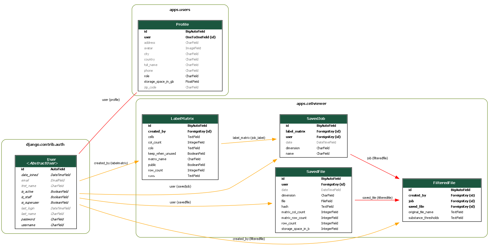

# Main docs

This will mention the general state of development of the application, future additions, and explain
some parts in a combined space. This will not be exhaustive, and the code will always be the most informative, 
then the function specific documentation.

A flowchart has been made to display the general flow of the application. [Flowchart](Codebase_flowchart_at_31-01-2025.drawio)

## Main experiment page

Currently, the main experiment page is set up in a weird way, it's important to know what has been taken into account for this.
The main thing is that the file input is not stored unless the user stores it. This means it needs to handle two cases
 - The file is sent through a post request.
 - The file is loaded from the database

A simpler way to have implemented this, was to save every inputted file, and clean up files after an interval.
This would simplify the codebase.

Currently you need to be very careful when making changes to it.

An important note also, is that it revalidates every time that the file being sent through the post request
is valid. This adds slowdown to the initial page. This is why loading a stored file is a lot faster.
I would recommend against removing this, as you should never trust a user. It is possible to
deactivate it after the first, or allow a setting by the user to not have it trigger every time.

## Database

The database is set up pretty well. The systems work good. The only thing it doesn't do at the moment is log
database writes and/or errors. This would be useful, if something goes wrong, you would know that
something went wrong. It also doesn't have any cleanup mechanisms for if files should be deleted, but it
fails to be deleted.

Another point is that while it's set up well, the database no longer gets used in the way it was originally intended.
It was originally intended that you input n amount of files, and those would be grouped together under an experiment.
Now an experiment (job) in the database, only gets assigned one file, and after this point, you can select
multiple experiments, and compare them. Devaluing the original intended usage.
The current structure of this will probably not be changed.
So it would be recommended to flatten the database out, moving the functionality and interface from SavedJob to FilterdFile, and reimplementing SavedJob.
Else you would need to add another many to one relation and database table if you want to aggregate multiple files with this specific structure.

Another note is that SavedFile exists to avoid saving the same large file a second time, it's possible that this is unnecessary and only saves
a few mega bytes with the current use. I don't recommend removing it, but it might add some complications to the code.

The main important parts of the database can bee seen in 

### users
Any information directly related to the users, is stored within the users app. Please keep this in mind when making changes, that you commit
the migration file stored in the users app. This is critical.

## Future additions

 - More visualizations
 - Display a line in the histogram of the threshold
 - choose the range or colors of the visualization.
   - This is useful for presentations
 - Search and filter functionality for stored jobs.
   - The list can quickly grow large
 - Integrate the LUMC authentication system
 - Improve the security
   - Specify who can see whose files
     - Currently everyone can see everyone's files.

## components

There are a few components for larger structures that get reused a few times. These are implemented using [django components](https://django-components.github.io/django-components/latest/overview/welcome/#quickstart).
It's possible to add more components there. Read the response modal documentation well when using it, as it
has a lot of issues surrounding it.

## Additional documentation

### Django

This application is written using Django, so I recommend having completed the [Django tutorial](https://docs.djangoproject.com/en/5.1/) as a starter.
After this it should be possible to understand most of the application and make impactful changes.

### Docker
The one important part to note about how the docker is currently setup is that [docker-entrypoint.sh](..%2Fdocker-entrypoint.sh) is necessary to ensure
that migrations are applied properly, it gets called by the DockerFile. The DockerFile doesn't call makemigrations
either, this should be properly handled in development manually.

Docker is important. Flowbite has a good description of the DockerFile of this project [Flowbite docker docs](docker.md)

### Tailwind

To style the front end, TailwindCSS is used. This is a css style with a different philosophy from normal css.
It can be really simple to make good looking elements with a lot of control using it.
However as I have not used components for a lot of elements, if you ever need to change the whole site, such as
the color style of every button to another color, this will include a lot of manual changes.
It might be interesting in the future to combine it with a bit more of components just for this, even if it
defeats a part of why tailwind is often used.
See the [tailwind docs](https://tailwindcss.com/docs/installation/using-vite), and the [Flowbite example](tailwind.md)

### Extended-user
It is possible to extend the user class, this is done in this app, look at [extended-user by Flowbite](extended-user.md) and the Django docs.

### Celery
At the moment of writing this celery is not used. However, it is very useful to use celery when jobs need
to be processed in the background separately from user interaction, or tasks need to be performed that
take very long. I recommend the Celery documentation. It's also possible to take a look at [Flowbite celery docs](celery.md)
This displays a decent example of some of the useful parts when getting started. That is why it's retained in this repository.

## ERD
If there is ever the need to regenerate the ERD of the database this is possible with:

This involves django-extensions, see the documentation for more info https://django-extensions.readthedocs.io/en/latest/graph_models.html
`pip install django-extensions`
`pip install pygraphviz` or `pip install pyparsing pydot`

It also requires adding django-extensions as installed application.
As there are no other uses of the extension, it is not left in the final build to reduce weight.

The following example makes use of pydot and manually excludes unwanted models, this is how the current models.png is made:

`py manage.py graph_models --pydot -X AbstractUser,Group,Token,TokenProxy,Session,AbstractBaseSession,TaskResult,LogEntry,Permission,ContentType,ChordCounter,GroupResult -a -g --arrow-shape normal --color-code-deletions -o models.png 
`
